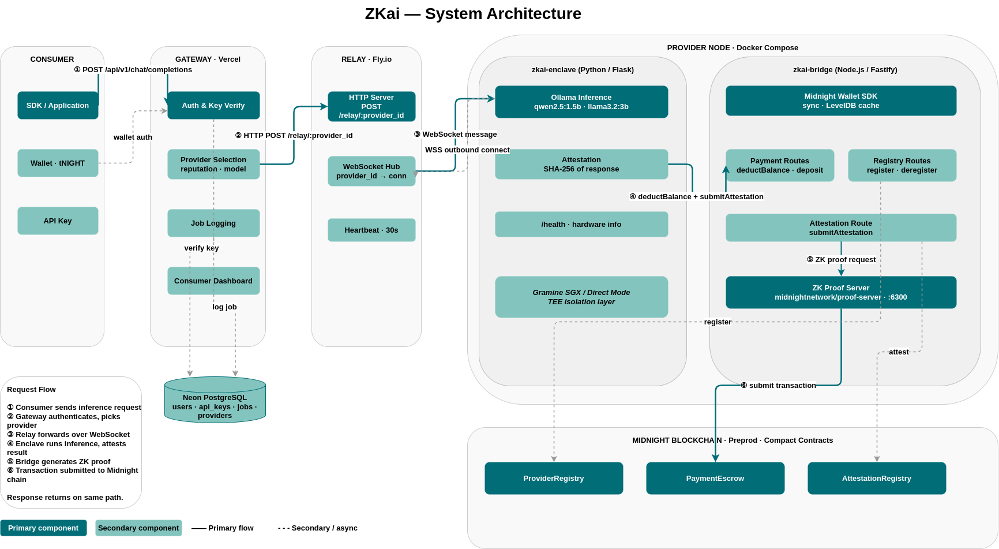

# ZKai — System Architecture

This document describes how ZKai moves an inference request from client entrypoint to on-chain settlement and back. It covers the runtime boundaries, the relay topology, the provider node split, and how attestation and payment are anchored on Midnight preprod. After reading it, you should understand which components are trusted, which are not, and where each security and billing responsibility lives. It is intended as a high-level technical map before diving into implementation files.

## 1. System Overview

ZKai is organized into five layers: Consumer, Gateway, Relay, Provider Node, and Midnight Blockchain. The consumer-facing frontend and gateway APIs are deployed on Vercel, while the request relay runs as a dedicated WebSocket service on Fly.io. Provider operators run a two-service node with `zkai-enclave` (inference + attestation) and `zkai-bridge` (wallet + contract interactions) in the same Docker Compose stack. Midnight preprod holds registry state, escrowed payment logic, and attestation anchoring. The design goal is that sensitive inference execution remains inside the enclave boundary while external services handle routing, indexing, and settlement orchestration.

## 2. Components

#### 2.1 Consumer (SDK / Application)

Purpose: the consumer is the caller that submits inference requests and receives OpenAI-compatible responses.

Consumers can be Python SDK clients, direct HTTP callers with API keys, wallet-authenticated dashboard users, or app integrations using the gateway endpoint. Requests enter through `POST /api/v1/chat/completions` using the same shape expected by OpenAI-style tooling. The response payload includes normal chat completion fields and, in gateway mode, additional job metadata under `x_zkai`. Consumer-side code never needs direct relay or bridge access because those layers are abstracted behind gateway routes.

#### 2.2 Gateway (Vercel)

Purpose: the gateway is the hosted control plane that authenticates, routes, and records inference jobs.

Gateway handlers verify API keys and wallet-linked user state from Neon PostgreSQL tables such as `users`, `api_keys`, `jobs`, and `providers`. After authentication, the gateway selects an active provider by model and reputation and forwards the request to either a direct enclave endpoint or the relay route for that provider ID. It writes job telemetry (provider, cost, token usage, attestation hash, latency metrics) for dashboard and analytics use. The gateway is routing and policy infrastructure; it does not run model inference itself.

#### 2.3 Neon PostgreSQL

Purpose: Neon stores operational data needed for authentication, provider discovery, and dashboard history.

The schema includes user records, API key lifecycle state, short-lived auth challenges, provider registrations, and completed job rows. This database supports key verification endpoints, wallet views, and model/provider statistics surfaced in the frontend. It acts as an off-chain convenience layer for real-time product behavior and analytics. Midnight contracts remain the source of truth for contract-enforced billing and attestation anchoring.

#### 2.4 Relay (Fly.io)

Purpose: the relay bridges gateway HTTP traffic to provider WebSocket sessions.

Providers keep persistent outbound connections open to `/provider?id=<provider_id>` on the relay, which removes any need for inbound ports on provider infrastructure. The gateway posts inference payloads to `/relay/:provider_id`; the relay forwards them with correlation IDs and returns provider responses over the same request context. A heartbeat loop runs every 30 seconds to prune stale connections and maintain liveness visibility. If a provider is offline, relay endpoints return immediate availability errors instead of blocking the caller indefinitely.

#### 2.5 Provider Node — zkai-enclave (Python / FastAPI)

Purpose: the enclave service executes inference and produces attestation artifacts.

`zkai-enclave` exposes `/pubkey`, `/infer`, `/v1/chat/completions`, `/attestation`, and `/health`. It uses Ollama for model execution, computes runtime metrics, and derives a SHA-256 report hash from attestation data. In direct mode, it decrypts client-encrypted payloads with X25519 + ChaCha20-Poly1305; in gateway mode it accepts OpenAI-style JSON and still produces attestation metadata. It runs under Gramine Direct Mode in development and is designed for SGX-backed mode in production-grade deployments.

#### 2.6 Provider Node — zkai-bridge (Node.js / Fastify)

Purpose: the bridge handles Midnight wallet state and contract calls outside the enclave process.

The bridge exposes route groups for payment, registry, and attestation operations plus a wallet sync health endpoint. It initializes a Midnight wallet facade, synchronizes state, and loads compiled Compact contracts before processing contract transactions. Payment calls route through `PaymentEscrow`, registry updates route through `ProviderRegistry`, and attestation posting routes through `AttestationRegistry`. The bridge also stores provider discovery snapshots and can sync provider registration status back to gateway APIs.

#### 2.7 ZK Proof Server

Purpose: the proof server generates proving artifacts required by Midnight contract flows.

Provider Docker Compose runs `midnightnetwork/proof-server` as a sidecar on port `6300`. The bridge uses this service through `PROOF_SERVER_URL` when proving contract calls for escrow and attestation updates. Keeping proof generation local to provider infrastructure avoids external proof dependencies for normal node operation. Contract verification still happens on Midnight, so invalid proofs are rejected at the ledger layer.

#### 2.8 Midnight Smart Contracts (Compact Language — Preprod)

Purpose: contracts enforce provider discovery, payment settlement, and attestation anchoring.

| Contract | Responsibility |
|---|---|
| `ProviderRegistry` | Provider registration, metadata publishing, active/inactive lifecycle |
| `PaymentEscrow` | Deposit, withdrawal, and per-job deduction logic for consumer balances |
| `AttestationRegistry` | Immutable on-chain anchoring of per-job attestation hashes |

Shielded balance semantics are provided by Midnight preprod primitives, while ZKai-specific policy is expressed in these Compact contracts.

#### 2.9 Frontend (Next.js — zkai.vercel.app)

Purpose: the frontend is the consumer and operator interface for the ZKai network.

The application provides wallet connectivity, API key management, provider browsing, model exploration, job receipts, and provider ranking views. It communicates through gateway and app API routes under `/api/*` and does not connect directly to provider WebSockets. Dashboard pages show usage, spend, and attestation-linked job history backed by Neon and gateway APIs. Deployment and runtime are aligned with the gateway on Vercel for a unified operational surface.

## 3. Request Flow — Step by Step

1. **Consumer → Gateway.** The client sends `POST /api/v1/chat/completions` with an API key or wallet-derived identity.
2. **Gateway authenticates and routes.** The gateway validates credentials in Neon, picks an active provider by model and reputation, and creates a pending job record.
3. **Gateway → Relay → Provider.** The gateway posts to `/relay/:provider_id` on Fly.io and the relay forwards the payload through the provider's persistent WebSocket connection.
4. **Enclave infers and attests.** `zkai-enclave` runs Ollama inference, computes response metrics, and generates an attestation hash for the job result.
5. **Bridge settles and anchors.** `zkai-bridge` posts contract transactions for payment deduction and attestation anchoring using Midnight wallet state and proof infrastructure.
6. **Confirmation and response return.** After state is updated, the response travels back through relay and gateway, and the job is finalized in database records.

The gateway, relay, and provider host OS observe only routed payload envelopes and attestation artifacts at each hop; sensitive model execution state exists only inside the enclave boundary.

## 4. Two-Container Provider Design

ZKai splits provider runtime into two services to keep trust boundaries narrow and responsibilities explicit. The enclave service is intentionally minimal: inference, encryption/decryption, attestation construction, and health reporting. Moving wallet, proof, and contract dependencies into that same process would enlarge the enclave attack surface and complicate Gramine runtime constraints.

The bridge service handles blockchain-facing concerns that do not require plaintext prompts or model internals. It receives job IDs, wallet identifiers, and attestation hashes, then coordinates payment and contract submissions. Communication between enclave and bridge happens over the internal Docker network so both services remain co-located but isolated by function. This separation also improves operability, because bridge restarts and wallet sync behavior can be managed independently from model runtime concerns.

## 5. Trust Model

| Component | Trusted | Threat if compromised | Mitigation |
|---|---|---|---|
| Gramine enclave boundary | Yes | Prompt and response confidentiality loss | Execution isolated in enclave process; attestation hash can be anchored on-chain |
| Provider host OS | No | Observation or tampering attempts outside enclave memory | Enclave memory isolation and deterministic API boundary reduce host visibility |
| Provider Docker runtime | No | Container-level snooping and process control risk | Keep secrets and inference state in enclave process; isolate bridge responsibilities |
| Gateway (Vercel) | Partially | Metadata exposure and routing manipulation | API auth, job logging, and provider selection controls; no model execution at gateway |
| Relay (Fly.io) | Partially | Traffic disruption or replay of routed envelopes | Correlation IDs, timeouts, and provider heartbeat/connection management |
| zkai-bridge | No | Incorrect contract submissions or stale wallet state | On-chain contract validation and deterministic circuit checks on Midnight |
| Midnight contracts | Yes | Incorrect settlement or attestation acceptance | Contract logic + proof verification enforce transition validity |
| ZK Proof Server | Yes (local) | Bad proofs leading to failed submissions | Proofs verified by contract; invalid proofs are rejected |
| Neon PostgreSQL | Partially | Exposure of operational metadata | Stores auth and telemetry data, not enclave internal memory state |

In Gramine Direct Mode (development), enclave isolation is software-simulated and primarily for local workflow parity. SGX mode on compatible hardware provides hardware-enforced isolation and stronger attestation guarantees.

## 6. Attestation Model

After inference, `zkai-enclave` builds an attestation report containing model and runtime fingerprints, then computes a SHA-256 `report_hash`. That hash is returned with the inference response metadata and can be submitted on-chain by bridge routes. Consumers or integrators can compare returned hashes with `AttestationRegistry` records to confirm the job artifact was anchored without mutation. This allows detection of tampering between model execution and external delivery layers. In SGX-backed deployments, enclave identity and attestation signing can be tied to hardware-rooted trust chains instead of development-mode self-signing.

## 7. On-chain Payment Lifecycle

1. The gateway selects a provider and checks caller identity and funding prerequisites before forwarding work.
2. The consumer deposits value into `PaymentEscrow`, and the provider job is processed against that balance policy.
3. After inference, bridge routes submit deduction and attestation transactions referencing job and provider identifiers.
4. Midnight contract logic validates each state transition and records attestation artifacts in `AttestationRegistry`.
5. If a job fails, times out, or cannot be validated, dispute and refund logic can return funds instead of releasing them.

## 8. Development vs Production

| Aspect | Development | Production |
|---|---|---|
| TEE mode | Gramine Direct Mode (software simulation) | Gramine SGX on compatible hardware |
| Attestation signing | Local/self-signed development report flow | Hardware-backed trust chain (planned SGX path) |
| SGX hardware required | No | Yes |
| Blockchain target | Midnight preprod | Midnight mainnet (planned) |
| Relay | Local test relay or hosted Fly relay | Hosted Fly relay |
| Gateway | Local Next.js dev server | Vercel deployment |
| Models | `qwen2.5:1.5b`, `llama3.2:3b` | Same set with future provider expansion |

## Related

- [README.md](README.md) — project overview and quick starts
- [sdk/README.md](sdk/README.md) — Python SDK, CLI, and bridge route reference
- [frontend/README.md](frontend/README.md) — frontend + gateway local development
- [RUNBOOK.md](RUNBOOK.md) — operations and troubleshooting workflow
